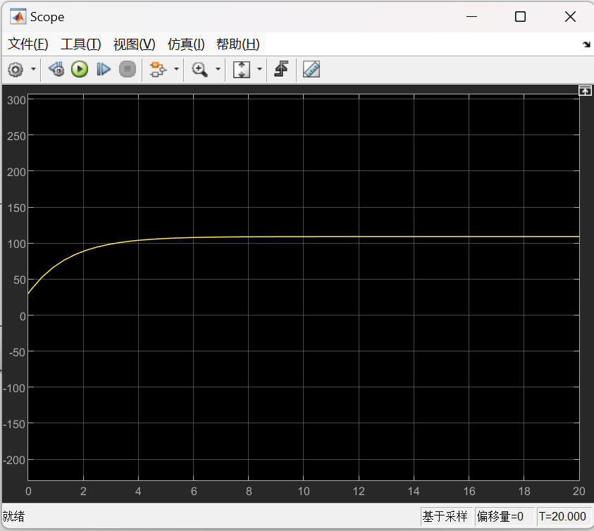

# Adaptive-Cruise-Control-System

---

## Overview

This project models and simulates an Adaptive Cruise Control (ACC) system using MATLAB/Simulink, focusing on two key functionalities: **vehicle speed-maintenance and distance-keeping** and **lane-centering control**.  

The system integrates realistic **longitudinal and lateral vehicle dynamics**, including aerodynamic drag, rolling resistance, and tire friction, to ensure physically accurate performance.  
Two control strategies,**PID** and **LQR**, were designed and compared under various speeds, slopes, and road conditions to analyze trade-offs between **stability**, **responsiveness**, and **energy efficiency**. 

Through simulation experiments, the ACC system successfully demonstrated smooth speed regulation, stable lane tracking, and reliable control responses comparable to modern autonomous driving features.

---

## Features
- **Vehicle Dynamics Modeling**: Longitudinal and lateral dynamics with aerodynamic drag, rolling resistance, and tire friction.  
- **PID Speed Control**: Maintains target speed under varying slopes and drag conditions.  
- **LQR Speed Optimization**: Minimizes control effort for smoother transitions and improved energy efficiency.  
- **Lane-Centering Control**: PID and state-space modeling to minimize lateral deviation.  
- **Comparative Simulation**: Evaluates controller responses under different speeds and road gradients.

---

## System Architecture
The system consists of four main functional modules implemented in MATLAB/Simulink:

1. **Vehicle Dynamics Module**: Simulates longitudinal motion through aerodynamic drag, rolling resistance, and tire friction models. It computes real-time velocity by integrating acceleration over time.
2. **PID Control Module**: Regulates the throttle input to minimize the difference between target and actual speed. Also used in lane-centering to correct lateral deviation.
3. **LQR Control Module**: Provides an alternative speed control structure optimized by minimizing the quadratic cost of state error and control effort.
4. **Lane-Centering System**: Uses sensor-based feedback to adjust the steering angle based on lateral position and yaw rate, maintaining lane stability.

These subsystems are interconnected within Simulink:
- The **longitudinal subsystem** includes drag and slope compensation.
- The **lateral subsystem** is represented by a **state-space model** describing steering and yaw dynamics.
- Closed-loop feedback links each control module to real-time vehicle responses.

---

## Technical Details

### Vehicle Dynamics
The longitudinal motion of the vehicle is modeled in Simulink using the following physical relation:

**Longitudinal Dynamics Equation:**

where  
- Fi: traction force  
- CD: drag coefficient  
- ρ: air density  
- A: frontal area  
- μ: rolling resistance coefficient  
- θ: road slope angle  
- m: vehicle mass  

This model accounts for aerodynamic drag, rolling resistance, tire friction, and slope,  
allowing the simulation to reflect realistic driving conditions.

**Simulink Implementation:**

---

### PID Control System

#### 1. Speed Control
The **PID controller** was designed for both longitudinal speed and lateral lane-centering control.  
It continuously adjusts throttle input based on the speed error between the target and actual velocity.  
A second PID loop is used to correct steering angle deviation, maintaining vehicle alignment within the lane.

**Simulink Block Diagram:**

Performance tuning focused on achieving a compromise between fast response and minimal overshoot.

#### 2. Lane-Centering Control
A second **PID controller** was implemented for **lane-centering**, ensuring lateral stability within the driving lane.  
The controller receives feedback on lateral deviation and yaw rate, then outputs steering angle corrections to minimize offset from the lane center.  
A state-space model of the lateral dynamics was used to support parameter tuning and analysis.

**Simulink Block Diagram:**

The lane-centering PID controller demonstrated quick correction of lateral errors and maintained a smooth, stable path with minimal oscillation.

---

### LQR Control System
An **LQR (Linear Quadratic Regulator)** controller was implemented as an alternative to PID for speed control.  
It optimizes the control input by minimizing a performance index that balances speed error and control effort,  
achieving smoother and more energy-efficient speed transitions under varying road slopes.

**Simulink Block Diagram:**

Compared with PID, the LQR system showed reduced oscillation and smoother acceleration.

---

## Simulation Setup

### 1. Speed Control Experiments (PID & LQR)

Two sets of speed-control simulations were conducted in MATLAB/Simulink to evaluate both PID and LQR performance under different initial conditions.

| Case | Controller | Initial Speed | Target Speed | Road Condition | Description |
|------|-------------|----------------|---------------|----------------|--------------|
| 1 | PID | 0 km/h | 100 km/h | Flat | Evaluate PID response and overshoot at start-up |
| 2 | PID | 30 km/h | 110 km/h | Flat | Assess PID tracking accuracy at higher speed |
| 3 | LQR | 0 km/h | 100 km/h | Flat | Compare LQR stability against PID |
| 4 | LQR | 30 km/h | 110 km/h | Inclined | Evaluate LQR smoothness under slope disturbance |

Each simulation ran for approximately 20 seconds, using the same longitudinal dynamics model that included aerodynamic drag, rolling resistance, and slope.

**PID Simulation Results:**

- For initial speed **0 → 100 km/h**, the PID controller achieved fast response and minimal steady-state error, with slight overshoot.  
- For **30 → 110 km/h**, PID maintained accuracy and stability even with increased speed.

**LQR Simulation Results:**

- LQR provided smoother acceleration with less overshoot compared to PID.  
- The controller maintained stability and optimized control effort under road slope variations.

---

### 2. Lane-Centering Experiments (PID Only)

For lateral control, an independent **PID lane-centering system** was tested.  
The controller measured the deviation from the lane center and adjusted the steering angle accordingly.  
Two initial deviation cases were used to verify system robustness.

| Case | Controller | Initial Speed | Initial Lateral Deviation | Target | Description |
|------|-------------|----------------|---------------------------|---------|--------------|
| 1 | PID | 0 km/h | 0.5 m | Center line | Lane-centering correction test |
| 2 | PID | 30 km/h | 1.0 m | Center line | Evaluate robustness to larger offset |

**Results:**

- The PID controller corrected lane deviation rapidly and maintained lateral stability.  
- Oscillations were small, and the vehicle quickly converged to the lane center.

---

## Results and Discussion

### PID vs LQR Performance Comparison
The **PID controller** demonstrated fast response and simplicity in tuning.  
It reached the target speed quickly but produced a small overshoot before stabilizing.  
In lane-centering control, PID minimized lateral error effectively and maintained vehicle stability with little oscillation.

The **LQR controller**, on the other hand, provided smoother acceleration and deceleration.  
By optimizing the balance between state error and control effort, it achieved better energy efficiency and improved comfort,  
especially when external disturbances such as slope or drag were present.

---

### Discussion
- **Speed Control:**  
  The PID controller offers rapid convergence suitable for real-time response,  
  while LQR provides smoother performance for energy-conscious systems.  
  Each method shows trade-offs between agility and smoothness.

- **Lane-Centering Control:**  
  The PID lane controller successfully reduced deviation within seconds, maintaining safe and stable alignment.  
  The use of a state-space lateral model enhanced tuning accuracy and overall performance.

- **Tuning and Parameter Sensitivity:**  
  PID tuning required multiple iterations to balance response and stability,  
  whereas LQR provided a more systematic design through matrix weighting adjustment.

---

## Future Work

Based on the current simulation outcomes, several directions are planned to enhance the Adaptive Cruise Control (ACC) system:

1. **Model Predictive Control (MPC):**  
   Implement MPC to further improve speed and lane coordination by predicting future vehicle states and optimizing control inputs in real time.

2. **Hardware-in-the-Loop (HIL) Testing:**  
   Conduct HIL experiments to validate the controller’s real-time performance and robustness under realistic driving scenarios.

3. **Integrated Longitudinal–Lateral Control:**  
   Combine speed and lane controllers into a unified framework for smoother transitions between acceleration and steering control.

4. **Sensor Fusion Integration:**  
   Introduce virtual sensors (camera, radar) to simulate environmental perception and enable adaptive control under dynamic traffic conditions.

5. **Driver Comfort Optimization:**  
   Refine controller parameters to minimize abrupt acceleration or steering changes and enhance passenger comfort.
